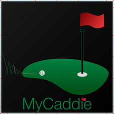

<!-- PROJECT SHIELDS -->

[![Status][status-shield]][status-link]
 
 
[![MIT License][license-shield]][license-url]

<!-- PROJECT LOGO -->
 

  

  <h3 align="center">MyCaddie</h3>

  

    iOS Application
     
    <a href="https://wmauz677.github.io/MyCaddie-Web/"><strong>Check out the Website »</strong></a>
     
  

<!-- TABLE OF CONTENTS -->

  
Table of Contents

  <ol>
    <li>
      <a href="#about-the-project">About The Project</a>
      <ul>
        <li><a href="#built-with">Built With</a></li>
      </ul>
    </li>
    <li><a href="#contributors">Contributors</a></li>
    <li><a href="#license">License</a></li>
    <li><a href="#acknowledgements">Acknowledgements</a></li>
  </ol>

<!-- ABOUT THE PROJECT -->
## About The Project

![MyCaddie Screenshot][product-screenshot]

MyCaddie is an iOS application built by Kevin Liao & Weston Mauz from 2017-2018.

The features of the app include: Shot tracking, stat tracking, golf course scorecard data, and creating new golf course data.

This was our first mobile application that we deployed to the App Store back on January 1st, 2018. This project was a stepping stone to our professional software development careers.

The application is no longer active on the app store. Check out our websites below to check out our most recent projects.

### Built With

Software
* [XCode](https://developer.apple.com/xcode/)
* [CocoaPods](https://cocoapods.org)

Languages
* [Swift](https://developer.apple.com/swift/)
* [Python](https://www.python.org)

Text Editors
* [Atom](https://atom.io)
* [Sublime Text](https://www.sublimetext.com)

Source Control
* [GitHub](https://github.com)
* [iTerm2](https://iterm2.com)

### Contributors

![MyCaddie Website Screenshot][liao-screenshot]
Kevin Liao
 

![MyCaddie Website Screenshot][mauz-screenshot]
Weston Mauz

<!-- LICENSE -->
## License

Distributed under the MIT License. See `LICENSE` for more information.

<!-- ACKNOWLEDGEMENTS -->
## Acknowledgements

Software
* [XCode](https://developer.apple.com/xcode/)
* [CocoaPods](https://cocoapods.org)
* [icons8](https://icons8.com)

Languages
* [Swift](https://developer.apple.com/swift/)
* [Python](https://www.python.org)

Text Editors
* [Atom](https://atom.io)
* [Sublime Text](https://www.sublimetext.com)

Source Control
* [GitHub](https://github.com)
* [iTerm2](https://iterm2.com)

Licensing
* [License](https://opensource.org/licenses/MIT)

Templates
* [README Template](https://github.com/othneildrew/Best-README-Template)

Website Deployment
* [GitHub Pages](https://pages.github.com)

<!-- MARKDOWN LINKS & IMAGES -->
[status-shield]: https://img.shields.io/website?down_color=lightgrey&down_message=offline&style=for-the-badge&up_color=green&up_message=online&url=https%3A%2F%2Fwmauz677.github.io%2FMyCaddie-Web%2F
[status-link]: https://wmauz677.github.io/MyCaddie-Web/
[license-shield]: https://img.shields.io/github/license/wmauz677/mycaddie-web?color=red&style=for-the-badge
[license-url]: https://github.com/kliao2016/MyCaddie/blob/master/LICENSE
[product-screenshot]: Images/main-screenshot.png
[liao-screenshot]: Images/liao-screenshot.png
[mauz-screenshot]: Images/mauz-screenshot.png
